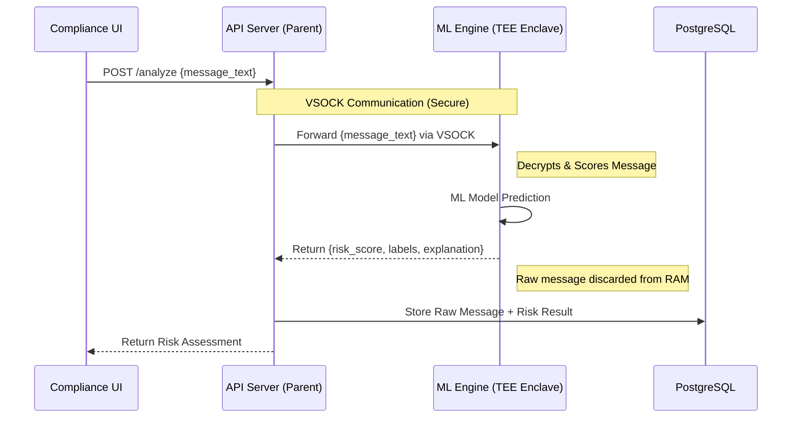

# CipherPulse — TEE Integration Guide (AWS Nitro Enclaves)

Based on the conceptual plan in our chat, this guide explains how to transition CipherPulse from local inference to **Confidential Computing** using TEEs.

## Architecture Overview

In a TEE-secured deployment, the application is split into two parts:

1.  **Parent Instance (EC2)**: Runs the FastAPI server, database, and UI. It handles external networking but **never** processes decrypted message text locally.
2.  **Nitro Enclave (TEE)**: A separate, hardened virtual machine with no storage, no interactive access, and no external networking. It runs the ML inference code.



---

## Implementation Steps

### 1. Create the Enclave Application (`enclave/app.py`)
This script runs inside the enclave. It must be minimal and communicate via VSOCK.

```python
import socket
import json
import joblib
# Load model artifacts inside the enclave
vectorizer = joblib.load("vectorizer.pkl")
model = joblib.load("model.pkl")

def handle_request(data):
    msg = json.loads(data)
    features = vectorizer.transform([msg['text']])
    # ... predict logic ...
    return {"risk_score": 85.2, "label": "MNPI"}

# Listen on VSOCK port
s = socket.socket(socket.AF_VSOCK, socket.SOCK_STREAM)
s.bind((socket.VMADDR_CID_ANY, 5000))
s.listen()

while True:
    conn, addr = s.accept()
    payload = conn.recv(4096)
    result = handle_request(payload)
    conn.sendall(json.dumps(result).encode())
    conn.close()
```

### 2. Update the Backend API (`backend/app/api/routes_analyze.py`)
Modify the endpoint to forward data to the enclave instead of using local ML artifacts.

```python
# Conceptual VSOCK client inside FastAPI
def score_via_enclave(text: str):
    import socket
    # CID 16 is usually the local enclave
    client = socket.socket(socket.AF_VSOCK, socket.SOCK_STREAM)
    client.connect((16, 5000)) 
    client.sendall(json.dumps({"text": text}).encode())
    response = client.recv(4096)
    return json.loads(response)
```

### 3. Build & Run the Enclave
You use the `nitro-cli` to package your enclave application into an EIF (Enclave Image File).

```bash
# Build the enclave image
nitro-cli build-enclave --docker-uri enclave-image:latest --output-file cipherpulse.eif

# Run the enclave
nitro-cli run-enclave --eif cipherpulse.eif --memory 2048 --cpu-count 2
```

---

## The "Attestation" Step (Crucial for Trust)

The financial firm (the client) doesn't just send data blindly. They perform **Remote Attestation**:

1.  **Request PCRs**: The client asks the parent instance for the enclave's PCR (Platform Configuration Register) values.
2.  **Verify Hash**: These PCRs contain a cryptographic hash of the `cipherpulse.eif`. The client compares this to the hash of the code they audited and approved.
3.  **AWS Signature**: The enclave produces an "Attestation Document" signed by the AWS Nitro Hypervisor. The client verifies this signature using the AWS Root CA.
4.  **Secure Channel**: Only if the hash matches and the signature is valid does the client send the data.

---

## Advantages of this Approach
*   **Zero-Trust**: Neither the developer nor the cloud provider can read the messages.
*   **Compliance**: Meets strict data residency and privacy requirements (GDPR, FINRA, SEC).
*   **Tamper-Proof**: If any line of code in the enclave is changed, the attestation hash will change, and the client will refuse to connect.
