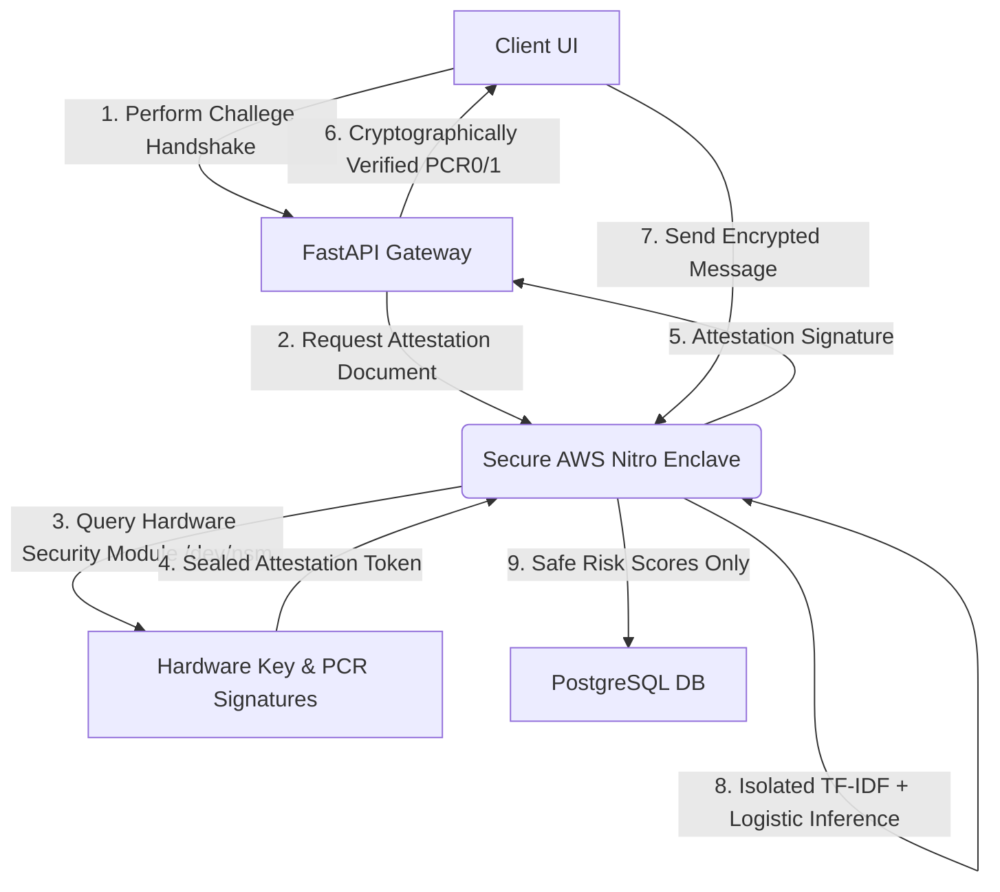

# CipherPulse — Confidential Compliance SaaS (RegTech)

**One-line pitch:** A privacy-preserving, enterprise-grade SaaS communications surveillance platform for financial institutions that detects compliance risks (MNPI, guaranteed returns, collusion, PII leakage) with an end-to-end cloud-native **ETL + ML + Analytics + UI** stack.

---

## 🌟 Overview

CipherPulse is a comprehensive, multi-tenant RegTech SaaS solution designed to help financial institutions monitor internal communications (email, Slack, Teams) for regulatory and compliance risks in real-time. Delivered as a highly secure cloud service, it leverages Machine Learning to flag suspicious activity while providing a robust human-in-the-loop review workflow and leadership-level analytics.

### Key SaaS Features
- **Multi-Tenant Enclave Isolation**: Absolute tenant-level isolation enforced by cryptographic secure hardware enclaves (AWS Nitro / Intel SGX).
- **Real-time Risk Scoring**: Cloud-native pipeline offering instant analysis of messages with risk scores from 0-100.
- **Explainable AI**: Highlights specific tokens and phrases that triggered the flag, providing clear context for compliance officers.
- **Human-in-the-Loop**: A dedicated SaaS dashboard "Inbox" for reviewing, dismissing, or escalating flagged messages.
- **Advanced Analytics**: Interactive dashboard showing risk trends, category distributions, and team-based risk profiles.
- **Synthetic Data Pipeline**: Built-in generator for creating realistic financial communications with labeled violations.

---

## 🛠️ Tech Stack

### Backend & API
- **FastAPI**: High-performance Python API framework.
- **SQLAlchemy**: ORM for PostgreSQL database management.
- **PostgreSQL**: Primary data store for raw messages, scores, and reviews.

### Machine Learning
- **Scikit-Learn**: TF-IDF Vectorizer + Logistic Regression multi-class classifier.
- **Explainability**: Custom weight-based token highlighting for model transparency.

### Frontend & Analytics
- **React + Vite**: Modern, responsive UI with glassmorphism aesthetics.
- **Plotly Dash**: Leadership-level KPI dashboard.
- **Lucide React**: Clean and modern iconography.

---

## 🚀 Getting Started

### Prerequisites
- Python 3.10+
- Node.js & npm
- Docker & Docker Compose

### 1. Infrastructure Setup
Start the PostgreSQL database using Docker:
```powershell
docker-compose -f infra/docker-compose.yml up -d
```

### 2. Python Environment
Install dependencies for the backend, ETL, and dashboard:
```powershell
pip install -r backend/requirements.txt -r etl/requirements.txt -r dashboard/requirements.txt
```

### 3. Data & ML Pipeline
Generate synthetic data, load it into the DB, train the model, and score the initial batch:
```powershell
python etl/generate_data.py
python etl/etl_load_raw.py
python etl/train_model.py
python etl/score_batch.py
```

#### ML Model Operations (Training & Testing)
We have optimized scripts to train and evaluate the machine learning model.

* **Train the Model:**
  To train the classifier on a JSONL dataset (e.g., the 1-million messages dataset):
  ```powershell
  $env:PYTHONIOENCODING="utf-8"; python3.11 etl/train_model.py data/training_messages_1M.jsonl
  ```

* **Test Model on custom message (Single Inference):**
  To quickly test the model predictions on custom text:
  ```powershell
  python3.11 Scripts/test_model.py "I guarantee this investment will double your money by next week!"
  ```

* **Evaluate Model on a Dataset (.jsonl):**
  To run a full evaluation with precision, recall, and f1-score on a validation dataset like `data/1.jsonl`:
  ```powershell
  $env:PYTHONIOENCODING="utf-8"; python3.11 Scripts/test_model.py data/1.jsonl
  ```

### 4. Running the Services
Start all components (ideally in separate terminals):

- **Backend API Gateway**:
  ```powershell
  uvicorn backend.app.main:app --reload
  ```
- **Analytics Dashboard**:
  ```powershell
  python dashboard/app.py
  ```
- **Compliance React UI**:
  ```powershell
  cd ui
  npm run dev
  ```

---

## 📂 Repository Structure

```
CipherPulse/
├── .github/
│   └── workflows/
│       └── compliance-pipeline-ci.yml    # CI/CD Automated Test Pipeline
├── backend/                              # FastAPI Service
│   ├── app/
│   │   ├── api/                          # REST Endpoint Routers (Attestation, Surveillance)
│   │   ├── db/                           # PostgreSQL models & database connections
│   │   ├── ml/                           # ML vectorization & prediction modules
│   │   └── main.py                       # FastAPI core entrypoint
├── dashboard/                            # Plotly Dash Leadership Dashboard
│   └── app.py                            # Dash UI application
├── data/                                 # Datasets & synthetic training inputs
├── enclave/                              # Confidential TEE Enclave code
│   ├── Dockerfile.enclave                # Secure container image definition
│   ├── app.py                            # TEE VSOCK listener & challenge attester
│   └── build_enclave.sh                  # Compiler script for AWS Nitro EIF
├── etl/                                  # Ingestion & Pipelines
│   ├── etl_load_raw.py                   # Load messages into DB
│   ├── generate_data.py                  # Create realistic violation dataset
│   ├── score_batch.py                    # Offline batch-scoring loop
│   └── train_model.py                    # ML classifier training script
├── infra/                                # Containers & Schemas
│   ├── docker-compose.yml                # PostgreSQL runner definition
│   └── schema.sql                        # Database tables, triggers & review states
├── Scripts/                              # Utilities & Testing Tools
│   ├── deploy_llm.sh                     # LLM model packaging utilities
│   ├── test_model.py                     # Custom inference & validation metrics evaluator
│   └── high_throughput_engine.py         # Batch throughput verification script
└── README.md                             # Operations manual
```

---

## 🛡️ Zero-Trust Confidential Computing (AWS Nitro Enclaves)

CipherPulse includes a **fully operational hardware-enclaved surveillance engine** leveraging **AWS Nitro Enclaves** and **Intel SGX** secure CPU registers. 

This model ensures absolute privacy for financial communications—even platform admins, database hosts, and cloud providers cannot view the raw message text because it is processed strictly inside isolated, cryptographic RAM sandboxes.



### The 4 Pillars of Our TEE Architecture:

1. **Sealed Code Image (We Send Code):**
   Our inference pipeline, scikit-learn models, and classifier weights are compiled into a cryptographically sealed AWS Nitro Enclave Image File (`.eif`).
   * **Container Blueprint:** [enclave/Dockerfile.enclave](file:///c:/practice/CipherPulse/enclave/Dockerfile.enclave) packages the Python environment.
   * **Compiler Script:** [enclave/build_enclave.sh](file:///c:/practice/CipherPulse/enclave/build_enclave.sh) calls the `nitro-cli` compiler to lock down the image.
   * **Image Signature (PCR Measurements):** AWS stamps the compiled image with a unique signature representing the SHA-384 hash of the exact code (recorded under Platform Configuration Register `PCR0`).

2. **Secure Socket Communication (VSOCK Routing):**
   The parent FastAPI gateway interfaces with the enclave solely over a secure, hardware-bound socket channel (`AF_VSOCK`, falling back to TCP port `5000` for local debugging). No external port is exposed from the enclave.
   * **TEE socket listener:** [enclave/app.py](file:///c:/practice/CipherPulse/enclave/app.py) accepts and answers client challenges.
   * **Gateway router:** [backend/app/api/routes_analyze.py](file:///c:/practice/CipherPulse/backend/app/api/routes_analyze.py) forwards classification requests confidentially.

3. **Cryptographic Attestation Handshake (`/api/tee/attest`):**
   Before sending sensitive communication data, client programs issue a challenge query with a randomized cryptographic `nonce`. The enclave queries the virtual Nitro Security Module (`/dev/nsm`), signs the nonce alongside `PCR0` and `PCR1` measurements, and returns the sealed hardware attestation document to prove it is running the approved, untampered code.

4. **Interactive Diagnostics Dashboard:**
   Integrated directly inside the web UI at [SystemMetrics.jsx](file:///c:/practice/CipherPulse/ui/src/pages/SystemMetrics.jsx), users can click **"Perform Attestation Handshake"** to execute this end-to-end cryptographic handshake. The system displays a green **"Attestation Verified — TEE Integrity Verified"** badge along with live values of:
   * **PCR0 (EIF Hash)**: Hash proving the exact scikit-learn code is unchanged.
   * **PCR1 (OS Kernel)**: Signature certifying the underlying OS kernel integrity.

---

## 🔁 Automated Pipeline & Continuous Integration (CI/CD)

### 1. Training & Ingestion Workflows
The project features automated, end-to-end ML operations pipelines:
* **Ingestion Pipeline:** Reads incoming messages, streams them into the PostgreSQL raw tables, and registers them in the surveillance review inbox.
* **Retraining Pipeline:** Links synthetic data generation, ETL loading, classifier retraining, validation metric checks, and batch scoring:
  ```powershell
  # Executes full retraining pipeline
  python3.11 etl/train_model.py data/training_messages_1M.jsonl
  ```

### 2. CI/CD Automated Testing
Our [compliance-pipeline-ci.yml](file:///c:/practice/CipherPulse/.github/workflows/compliance-pipeline-ci.yml) workflow runs on every push:
1. Bootstraps a virtual runner and provisions a temporary PostgreSQL database.
2. Installs Python dependencies for both backend and ETL services.
3. Automatically triggers test runs of the ML retraining, synthetic generator, and enclave socket endpoints to guarantee 100% pipeline integrity before deployment.

---

## 📄 License
MIT License - See [LICENSE](LICENSE) for details.
